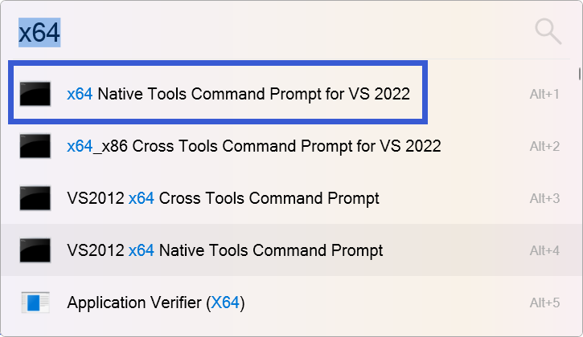
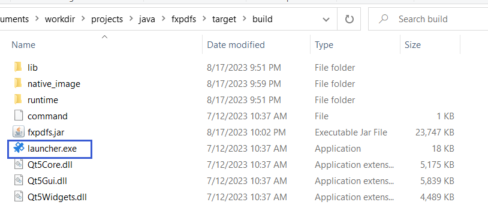
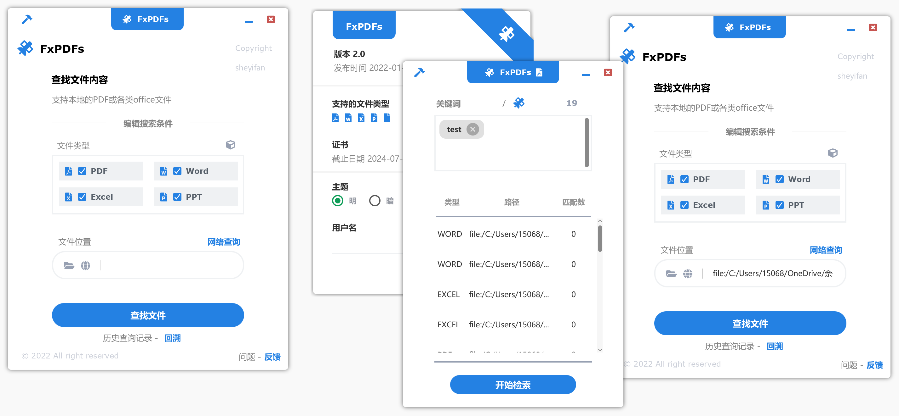

# FxPDFs

## 介绍
FxPDFs是一个用于快检索索PDF、Office内容的软件，界面技术基于javafx，内容检索使用了并行技术以优化检索速率。  
简单的命令即可完成构建，同时生成两种可发布的软件包：1. 基于jlink裁剪的JRE + jar包；2. 基于native image的AOT二进制可执行文件  

## 开发平台
* Liberica NIK 23.0.1 (Java 17.0.8)
* Maven 3.9.0+
* Windows 10+
* Visual Studio 2019+  
  
Linux平台也可编译运行，但是native image、jlink裁剪发布软件包的功能尚未经过测试。推荐使用windows平台  


## 编译教程

打开x64 Visual Studio Native Tools Command Prompt命令行终端，输入以下命令：  

<div style="text-align: center">
  
</div>

1. `mvn clean package`
   生成jar包，并将依赖库安装到target/lib/commons文件夹下。生成jlink JRE + jar包的软件包，路径为target/build，可以直接双击运行  

  

2. `mvn -Pnative -Dagent exec:exec@java-agent`  
   跑tracing agent，生成native image之前需要做的动作。该命令会直接启动程序，但是程序过程中用到的资源会被agent自动记录到配置文件。访问程序的各个界面和各项功能，这样可以保证资源都被agent加载  

3. `mvn -Pnative -Dagent package`
   生成native image，内存足够的情况下大概需要5分钟。编译过程需要占用6G以上的内存，请关闭电脑上大部分软件，否则会报错内存不足  

编译产物的目录结构如下：  

```bash
/
│   .gitignore
│   fortune.bgv
│   LICENSE
│   pom.xml
│   README.md
│   userdata.properties
│
├───lib  # 命令行工具
│
├───src  # 源码、资源文件
│
├───target
│   │   fxpdfs-jar-with-dependencies.jar  # uber jar包
│   │   fxpdfs.jar                        # 无依赖的jar包
│   ├───archive-tmp
│   ├───build
│   │   │   command
│   │   │   fxpdfs.jar
│   │   │   launcher.exe                  # java + 裁剪版JRE启动器
│   │   │   Qt5Core.dll
│   │   │   Qt5Gui.dll
│   │   │   Qt5Widgets.dll
│   │   │
│   │   ├───lib
│   │   │   ├───commons                   # 程序依赖的jar包
│   │   │   │
│   │   │   └───win                       
│   │   │       └───cmd                   # 命令行启动java程序的脚本
│   │   │
│   │   ├───native_image                  # native image
│   │   │   │   awt.dll
│   │   │   │   fontmanager.dll
│   │   │   │   freetype.dll
│   │   │   │   fxpdfs.exe                # native image 可执行文件
│   │   │   │   java.dll
│   │   │   │   javaaccessbridge.dll
│   │   │   │   javajpeg.dll
│   │   │   │   jawt.dll
│   │   │   │   jvm.dll
│   │   │   │   lcms.dll
│   │   │   └───userdata.properties
│   │   │
│   │   └───runtime                       # jlink生成的裁剪版java运行时
```

有两种启动程序的方式，一种是双击**target/buildlauncher.exe**，此时是通过JVM启动java程序，但是采用的是经过jlink裁剪过的java运行时；另一种是双击**target/build/native_image/fxpdfs.exe**，此时执行的是native image。  

## demo


