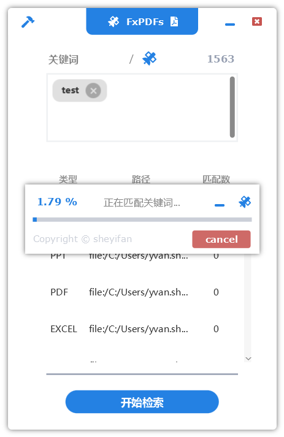

# FxPDFs

## 介绍
FxPDFs是一个用于快检索索PDF、Office内容的软件，界面技术基于javafx，内容检索使用了并行技术以优化检索速率  
简单的命令即可完成构建，同时生成两种可发布的软件包：1. 基于jlink裁剪的JRE + jar包；2. 基于native image的AOT二进制可执行文件  

## 平台
* Liberica NIK 23.0.1 (Java 17.0.8)
* Maven 3.9.0+
* Windows 10+
* Visual Studio 2019+ 
* A JavaFX Application
  
Linux平台也可编译运行，但是native image、jlink裁剪发布软件包的功能尚未经过测试。推荐使用windows平台  

## 编译教程

1. `mvn clean package`
   生成jar包，并将依赖库安装到target/lib/commons文件夹下。生成jlink JRE + jar包的软件包，路径为target/build，可以直接双击运行  

  

2. `mvn -Pnative -Dagent exec:exec@java-agent`  
   跑tracing agent，生成native image之前需要做的动作。该命令会直接启动程序，但是程序过程中用到的资源会被agent自动记录到配置文件。访问程序的各个界面和各项功能，这样可以保证资源都被agent加载  

3. `mvn -Pnative -Dagent package`
   生成native image，内存足够的情况下大概需要5分钟。编译过程需要占用6G以上的内存，请关闭电脑上大部分软件，否则会报错内存不足  

  

## demo

  

  

  

  
